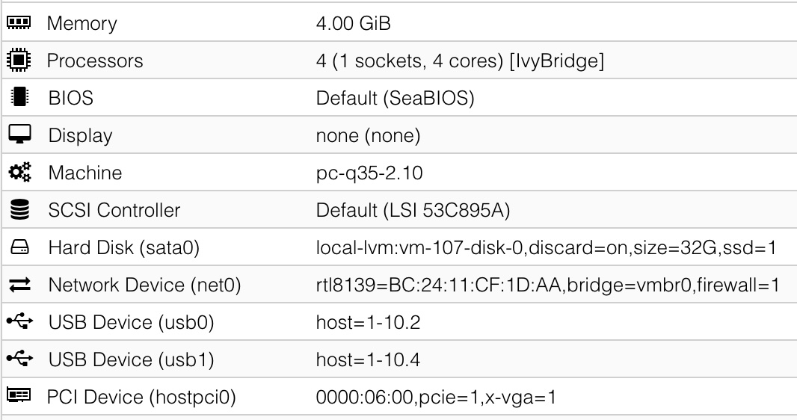
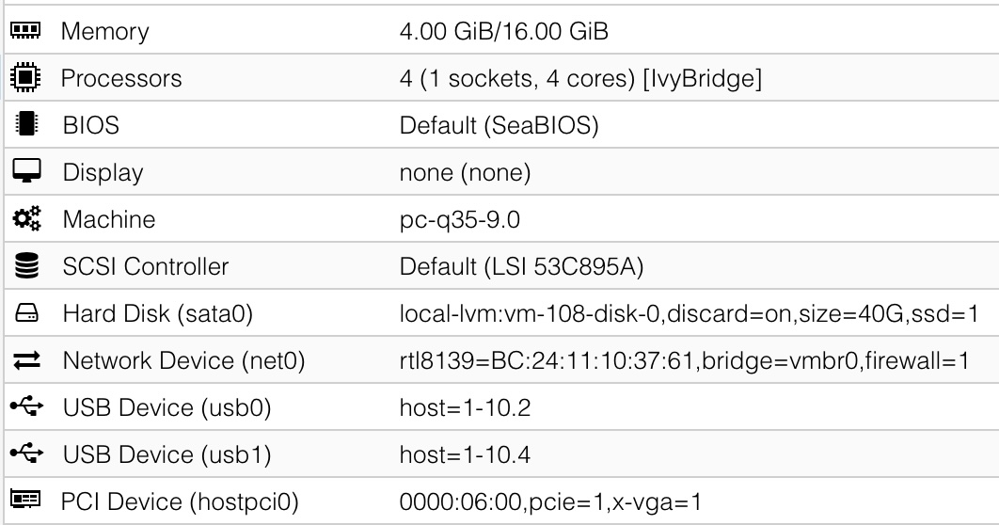

[Back to main page](README.md)

# proxmox-notes
This document holds all of my experience so far with Proxmox, with a focus on retro OSes. Windows 98, Windows XP, Windows Vista.

Proxmox version: 8.2

Machine 1 - **Modern machine**
- CPU: i7 6700K
- iGPU: Intel HD 530
- Asus Maximus Hero VIII motherboard
- GPU1: RTX 3090
- GPU2: AMD R5 340X/R7 250
  
Machine 2 - **Time machine**
- CPU: i7 3770
- iGPU: Intel HD 4000
- Dell Optiplex 7010 MT motherboard
- GPU1: AMD HD 6450
- GPU2: Geforce FX 5500

## What is Proxmox
Proxmox is a Linux-based Type 1 Hypervisor. Some other Type 1 Hypervisors are Hyper-V (only when running on Windows Server), Red Hat Enterprise Virtualisation (RHEV) and vSphere (EXSi).

If you used VMWare, VirtualBox or Parallels before, you know what a Hypervisor is. Those are Type 2 Hypervisors. Type 2s are slow and inefficient, but they are convenient because you can run them on top of Windows, Mac or Linux, and easily share files between the host and the guest.

Type 1s on the other hand are a beast. They lack the convenience features, but they have extremely low overheads and very efficient. You can directly pass through physical hardware to the VMs, getting all the native performance, while keeping the benefits of virtual machines such as ease of backing up, portability and even compatibility. If running a XP VM in VMWare feels sluggish and laggy at times, running XP in a Proxmox VM feels like native, or even faster since hardware that supports XP are getting older.

Yes, you can run XP and Vista, and even Windows 98 on unsupported motherboards and CPUs (*). I'm running XP and Vista on my modern machine via Proxmox, with full GPU acceleration. And I'm running regular full backups and uploading them straight to the cloud, **all while the VMs are running**. How cool is that?

(*) _Provided that the OS runs on a generation of x86 CPUs that KVM supports. KVM is the open-source virtualisation software that Proxmox uses under the hood. At the moment, KVM should support all the way back to DOS, even though Proxmox only lists Windows 2000 minimum._

Why Proxmox? Because it is Linux, free and open-source, and has a huge community.

There is a big catch. Type 1 hypervisors such as Proxmox have a very steep learning curve, it is not for the faint of heart. For instance, Proxmox doesn't come with a desktop environment, and you need another computer to use its web interface. Moreover, you'll need to learn (usually the hard way) which combinations of hardware work well and which don't. Also, while you don't have to be a Linux wizard, having fluency in it helps tremendously.

## Pre-requisites
### Hardware
#### Motherboard & CPU
For any of this to work well, your motherboard and CPU need to support hardware isolation which is called **IOMMU groupings**. I believe this technology is called VT-d in most motherboard BIOS. But just supporting and turning on VT-d is not enough. the motherboard's IOMMU groupings need to be separated enough. 

In layman's terms, this means the motherboard can allow some important hardware components (such as each PCI/PCIe slot) to be individually isolated and passed through to a Proxmox virtual machine. Without proper IOMMU groupings, hardware passthrough might be extremely painful or even impossible.

This is why if you want a machine to run Proxmox or any other type 1 hypervisor with hardware pass-through, you should build a machine around that requirement. I believe that server motherboards will more likely satisfy this requirement, consumer motherboards will likely be hit or miss.

For the CPU, it is not as important as long as it is x86, as it can be virtualised or emulated by KVM/Proxmox with decent speeds. Since retro OSes don't consume much CPU cycles, we should get decent speeds regardless. Not sure how this would work on an ARM based system as I have not tried.

My modern machine has decent IOMMU groupings but not great. It has 3 long PCIe slots, 2 of which are separately grouped, which means I can pass through 2 GPUs to 2 different VMs. It has 3 PCIe x1 slots, but 2 out of 3 are disabled if one of the long PCIe slots mentioned above is occupied. This means I can have 1 main GPU for modern games, 1 retro GPU for XP/Vista, and 1 PCIe x1 slot for a sound card or whichever PCIe device (Note that my Sound Blaster XFi doesn't work on XP VMs for some strange reason).

#### GPU (Read - Important for Nvidia)
Next, the GPU needs to support the OS. This means we need a GPU from the era that has drivers for the specific OS we need. For example:
- Nvidia FX 5500 for Windows 98
- Nvidia GTX 750 Ti for Windows XP

For consumer Nvidia cards on Windows XP up to Windows 7, there is an issue with official drivers which disables itself when it detects that we are running in a VM. The affected drivers are roughly from versions 337.88, 340.52 and above.
To get pass this issue, we need to put this to our vm arguments `-cpu host,kvm=off`. I've verified that this works for driver version 337.88 and 340.52. For newer drivers, we apparently need to disable some kvm optimisations, which will tank performance so I'm not very interested.

Professional Nvidia (i.e. Quadro) and AMD cards do not have this issue.

The latest Nvidia consumer drivers on Windows 10 and up added "support" for virtualisation, so it's not an issue for that use case.

#### Sound
As for sound, for XP and up we can get by with the GPU's HDMI/DP Audio output or a USB DAC. There is a Sound Blaster XFi Go! USB that has hardware-accelerated EAX which looks interesting.
For Windows 98, we most likely need a PCI slot on the motherboard or a PCIe to PCI bridge, to use a PCI sound card.
I have not tried emulated sound hardware in Proxmox, but looks like this option relies on [SPICE](https://pve.proxmox.com/wiki/SPICE), which is a set of remote tools and does not output sound directly on the host. 

### Setting up Proxmox
#### Modern machine 
Firstly, do NOT follow the GPU passthrough guides out there blindly. For example, what I found is that adding boot flags to the grub entry did nothing for me, and GPU passthrough works without them. My hypothesis is that the latest versions of Proxmox already have built-in fixes for most PCI passthrough issues, and the guides are outdated. In the end, what matters is whether your motherboard and CPU support hardware isolation which is called **IOMMU groupings**.

Here's what I have done:
- Enabling VT-D in the BIOS
- Add virtio modules in Proxmox (we may even not need to do this, I haven't tested)
```
nano /etc/modules
```
```
vfio
vfio_iommu_type1
vfio_pci
vfio_virqfd
```
- Blacklisting drivers in Proxmox (we may even not need to do this, I haven't tested)
```
nano /etc/modprobe.d/blacklist.conf
```
```
blacklist radeon
blacklist nouveau
blacklist nvidia
# iGPU
blacklist snd_hda_intel
blacklist snd_hda_codec_hdmi
blacklist i915
```
- Set 2 options in kvm.conf, not sure what they do (we may even not need to do this, I haven't tested)
```
nano /etc/modprobe.d/kvm.conf
```
```
options kvm ignore_msrs=Y report_ignored_msrs=0
```

Another thing we should do is set up our BIOS so that the IGPU is used to boot the computer and run Proxmox. That way all of our discreet GPUs will be able to see the VM's boot sequence and we won't get the above issue. Otherwise, we may get a black screen until the OS inside the VM loads the graphics driver.

Apparently, if the GPU is used to boot Proxmox, its vbios is touched somehow which prevents the card from showing VM boot screen.

#### Time machine
The above configuration even though allows GPU Passthrough to function on this machine, I could not get the GPU to output the boot sequence if the VM uses UEFI. If the VM uses SeaBIOS, the HD 6450 can output the boot sequence. The Geforce FX 5500 on the other hand will not output boot sequence for either type. However, I know the pass-through works because I could get Windows 11 to output an image on the FX 5500 when the drivers load.

Note that apparently, we shouldn't use Intel iGPU for booting Proxmox, because there is an issue with Intel iGPU that causes legacy GPUs to not work properly in Proxmox? This seems to make no difference in my setup.

#### ACS Override kernel patch
Note: For motherboards with bad IOMMU groupings, there is a workaround called ACS override which sacrifices security for more IOMMU grouping possibilities.
```
nano /etc/default/grub
```
Then add `pcie_acs_override=downstream` to `GRUB_CMDLINE_LINUX_DEFAULT` like below
```
GRUB_CMDLINE_LINUX_DEFAULT="quiet pcie_acs_override=downstream"
```
This will enable a kernel patch which may make your IOMMU groupings more flexible, [at the cost of security](proxmox-acs-override-vulnerability.md).

### GPU vbios dumping
We can dump the GPU's vbios rom to supposedly preserve this ability to see the VM's boot sequence in case it breaks for whatever reason, but I have not confirmed whether this works. 
In all the different guides online, we'll only find these steps:
```
cd /sys/devices/[device-id-here]
echo 1 > rom
cat rom > /tmp/romfile
echo 0 > rom
```
However, if we do this while the IGPU is used for booting, we'll get this error `cat: rom: Input/output error`.
To dump this, here are the steps that worked for me:
```
find /sys/devices -name rom
```
This lists all the paths to a possible rom in all of our devices. Take note of the device that we want the rom from (we will need to know our device id for this, but it can be easily seen from Proxmox's PCI Passthrough menu). 
For example, this could be
```
/sys/devices/pci0000:16/0000:16:00.0/0000:17:00.0/0000:18:08.0/0000:19:00.0/0000:1a:10.0/0000:22:00.0/0000:23:00.0/0000:24:00.0/rom
```
Copy the whole thing.

Run this to somehow allow us to read the rom. I will not pretend that I understand what it does, but it works.
```
setpci -s [device id] COMMAND=2:2 (manually manipulate the memory enable bit with setpci)
# For example:
# setpci -s 0000:24:00.0 COMMAND=2:2
echo 1 > [paste the thing that we copied from above]
cat [paste the thing] > /tmp/romfile
echo 0 > [paste the thing]
setpci -s [device id] COMMAND=0:2
```

Once we have our romfile, for example, if we put it at `~/gpuroms/rtx3090.rom`, here's how to add it to the VM.
```
nano /etc/pve/qemu-server/[vmid].conf
```
Go to the GPU device, the line should start with `pci`. Add this to the comma-separated list
`romfile=../../../root/gpuroms/rtx3090.rom`

The 3 backlashes are needed because for some reason, Proxmox tries to find the rom in the wrong location even if we put in the full path (in this case it is `/root/gpuroms/rtx3090.rom`), so we need to get back to the root for the path to work.

### VirtIO drivers
https://pve.proxmox.com/wiki/Windows_VirtIO_Drivers

This driver is a bit like VMWare tools, but mainly for insanely fast networking and disk IO within the VMs. The drivers should work for Windows XP and up. 

The Linux kernel supports VirtIO out of the box, so this separate driver ISO is only required for Windows.

### Soundcard passthrough
I have tried passthrough a Soundblaster XFi but that freezes the entire physical machine. It seems the reason is that the Proxmox host somehow gets a hold of the card, which would be weird, because Proxmox doesn't have any audio output.

The freezing stops happening if I do this
```
nano /etc/modprobe.d/vfio.conf
```
```
options vfio-pci ids=1102:000b
```
The id above `1102:000b` is the hardware id of the soundcard. This will force Proxmox to not use this soundcard.

Now, the XP VM will recognise the card and the drivers will install successfully. However, there is no sound output. It seems there is an issue with the drivers of the XFi on XP. The sound card works fine on Vista with Windows default drivers. However, if I boot into XP with the drivers installed and the sound card attached, the card isn't released properly once the XP VM is shut down. If I boot into Vista again, it does not see the sound card, and only a reboot of the Proxmox host will fix it.

However, the same drivers work fine on a real XP machine. 

Perhaps getting this card to work under XP is a futile endeavour after all.

### SSD Protection
Go [here](ssd-protection-proxmox.md) to learn about how to protect your Proxmox installed SSD from frequent writes.

## Windows XP
### Machine type
q35-2.10. Any newer version of q35 will crash the XP installer with an error about the bios not being fully APCI compliant.

If we go to the Options tab and turn off APCI, then newer versions of q35 will not crash the XP installer, but we'll have other problems with hardware drivers that make it not worth it. So we should stick to q35-2.10. Note that this will make XP 32 & 64 bit unable to shut down fully, and XP 32 bit shut down when trying to reboot.

Also note that it might be possible to forcefully insert a newer community compiled apci.sys driver for XP, but I haven't tested this. Losing the ability to shut down fully from inside the VM isn't big deal, we can always force shut down the VM from the Proxmox dashboard.

### Virtual hard drive
Since the Windows XP & Vista installer will not know how to deal with modern hard drives, we first should create & format our VM drive on a Windows 10/11 VM with MBR, NTFS. Then reassign the drive to the Win XP/Vista VM and proceed with installation. 

For the installation, virtual hard disk must be either IDE or SATA (SATA is faster than IDE). We can enable Discard and SSD emulation and possibly use SSD Tweaker Pro to run Trim. 

For XP 64 bit, we have the option to use VirtIO for our storage device, but it will have to be after the initial Windows installation with IDE/SATA. To prepare for VirtIO drivers installation, add a dummy 1GB virtual hard disk and select the VirtIO protocol. After the installation, Windows will ask for drivers for an unknown SCSI controller, and we can find the drivers in the VirtIO ISO. 

After successfully installing the VirtIO SCSI controller, we can stop the VM, detach our boot disk, reattach it using the VirtIO protocol, make sure Discard is checked for TRIM support, and the device is selected in Boot Order in the Options tab. Now we can remove the dummy 1GB VirtIO disk.

On XP 32 bit, the VirtIO drivers for storage doesn't work for me, so I have to stick to SATA.

### Network card
VirtIO. After installation, Windows will ask for drivers for unknown Ethernet card, and we can find drivers in the VirtIO ISO. Alternatively, select Realtek 8139 since it will work under XP and Vista by default, no need for 3rd party drivers. 

### Other notes


If installing XP 32 bit, we need to press F6 when the installer begins and install a AHCI driver. We'll need to attach [xp-satadrivers-ich9-flp.img](disk-images/xp-satadrivers-ich9-flp.img) as a floppy for the installer to see it. To do this, upload the img to proxmox, and add this line to the vm's conf
```
args: -fda /var/lib/vz/template/iso/xp-satadrivers-ich9-flp.img
```
After pressing F6, pick the one that says **Intel(R) ICH9R/DO/DH SATA AHCI Controller**

Great resources:
- https://forum.mattkc.com/viewtopic.php?t=206

## Windows Vista
### Machine type
Can run perfectly with q35 latest, no additional AHCI drivers required.

### Virtual hard drive
Since the Windows XP & Vista installer will not know how to deal with modern hard drives, we first should create & format our VM drive on a Windows 10/11 VM with MBR, NTFS. Then reassign the drive to the Win XP/Vista VM and proceed with installation. 

For the installation, virtual hard disk must be either IDE or SATA (SATA is faster than IDE). To prepare for VirtIO drivers installation, add a dummy 1GB virtual hard disk and select the VirtIO protocol. After the installation, Windows will ask for drivers for an unknown SCSI controller, and we can find the drivers in the VirtIO ISO. 

After successfully installing the VirtIO SCSI controller, we can stop the VM, detach our boot disk, reattach it using the VirtIO protocol, make sure Discard is checked for TRIM support, and the device is selected in Boot Order in the Options tab. Now we can remove the dummy 1GB VirtIO disk.

### Network card
VirtIO. After installation, Windows will ask for drivers for unknown Ethernet card, and we can find drivers in the VirtIO ISO. Alternatively, select Realtek 8139 since it will work under XP and Vista by default, no need for 3rd party drivers. 

### Other notes


If we run the VM with an emulated GPU such as by using the VMWare compatible display, Windows Vista might not load the drivers for our passed through GPU correctly, giving a code 12 error. In this case, we should try setting Display to None and ticking the Primary GPU checkbox for the GPU passthrough.

## Windows 98
### Machine type
Can run with the latest i440 machine type (9.0 at this time), but according to [this Vogons post](https://www.vogons.org/viewtopic.php?t=94012), we can get SB16 emulation if we pick 2.11. However picking 2.11 will make the machine unable to shut down fully. 

### Virtual hard drive
Has to be IDE. There are no Win 9x VirtIO drivers. The SSD emulation and Discard checkboxes don't matter because there is no way to do TRIM on Win 9x.

Since the Windows 98 installer will not know how to deal with modern hard drives, we first should format our VM drive on a Windows 10/11 VM with MBR, FAT32. Then reassign the drive to the Win 98 VM and proceed with installation.

### Network card
For networking, select Intel E1000. Drivers can be installed from the ISO in the next section

### Other notes
I have not been able to get GPU Passthrough to work for this.
I have also not been able to use USB mouse and keyboard, Windows will just crash with Windows Protection Error as soon as I move the mouse.

To add PS/2 mouse & keyboard to the VM, find out the path of your PS/2 devices by
```
cd /dev/input/by-path
ls
```
Then add it to the VM by editting its conf file and adding to args
```
args: -object 'input-linux,id=kbd1,evdev=/dev/input/by-path/YOURKEYBOARD,grab_all=on,repeat=on'
```

After installation, copy the Win98 folder of the Windows 98 CD to C: drive. We need to do this because the CD drive will disappear some time during the next step. Then go to Device Manager, select Plug and Play BIOS, update drivers, show all hardware, select PCI Bus. We'll need the Windows 98 CD for this part. After that, a few more devices will be recognised and installed. 

For networking, use the PRO98_10.1.exe drivers from [Win98drivers.iso](disk-images/Win98drivers.iso).

This iso also contains 7z and NVidia drivers.

Great resources:
- https://www.vogons.org/viewtopic.php?t=94012
- https://blog.stevesec.com/2024/05/03/installing-windows-98-on-a-proxmox-ve/

## Cloud Backups

I have created a fork of TheRealAlexV's proxmox-vzbackup-rclone [here](https://github.com/hoangbv15/proxmox-vzbackup-rclone).
This script will do 2 things
- Compress everything under /etc, /var/lib/pve-cluster and /root into a tar in a ramdisk, and upload it using rclone
- Upload everything under your gzdump folder using rclone

For this to work, first we need to setup rclone. First install rclone
```
apt-get update
apt-get install rclone
apt-get install git
```
Then follow this guide [here](https://rclone.org/pcloud/) to set it up with pCloud or whichever cloud backup provider you use (which is compatible with rclone).
After that, simply git clone the script:
```
git clone https://github.com/hoangbv15/proxmox-vzbackup-rclone
cd proxmox-vzbackup-rclone
chmod +x vzbackup-rclone.sh
```
Edit the script to set the path to your dumps. It would be `/var/lib/vz/dump` by default if you just dump to the same disk as your Proxmox installation.
A full backup upload can be manually started with the command
```
/root/proxmox-vzbackup-rclone/vzbackup-rclone.sh full-backup
```
However keep in mind that the process will take a **very** long time, and the vnc connection might time out. If it does, the session will close and the upload will stop. So it's best to use a cron task for this.

To schedule this clone weekly, we could use vanilla cron, but that requires the computer to be on at a specific time. So we'll instead use `anacron`, which will allow us to run tasks on a non-absolute timing, best-effort basis.
To install `anacron`:
```
apt install anacron
```
Then run `nano /etc/anacrontab`, read the examples and add a line to schedule our backup cloud upload. In my case, I want to run the upload weekly, so I added
```
7       10      rclone-backup   /root/proxmox-vzbackup-rclone/vzbackup-rclone.sh full-backup
```
The 10 here means the job will be delayed by 10 minutes after booting.
