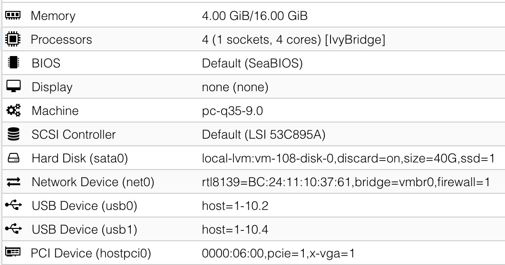

[Back to Proxmox](README.md)

## Windows XP
### Machine type
Either i440 latest, or q35-2.10. Any newer version of q35 will crash the XP installer with an error about the bios not being fully APCI compliant.

If we go to the Options tab and turn off APCI, then newer versions of q35 will not crash the XP installer, but we'll have other problems with hardware drivers that make it not worth it. So we should stick to q35-2.10. Note that this will make XP 32 & 64 bit unable to shut down fully, and XP 32 bit shut down when trying to reboot.

Also note that it might be possible to forcefully insert a newer community compiled apci.sys driver for XP, but I haven't tested this. Losing the ability to shut down fully from inside the VM isn't big deal, we can always force stop the VM from the Proxmox dashboard.

If we select i440 latest, we won't have any issues with APCI. The only potential issue is that the i440 machine type only has PCI passthrough. We can still passthrough PCIe devices, but they will appear as PCI to the VM. Note that I have tried this with my PCIe GPU (the GT 640), and I didn't see any performance hit, so this might be a non-issue.

The other upside of using i440 is the ability to emulate an Intel AC97 sound card, which Windows XP supports out of the box.

### Virtual hard drive
Since the Windows XP & Vista installer will not know how to properly format modern hard drives, we first should create & format our VM drive on a Windows 10/11 VM with MBR, NTFS. Then reassign the drive to the Win XP/Vista VM and proceed with installation. 

For the installation, virtual hard disk must be either IDE or SATA (SATA is faster than IDE). We can enable Discard and SSD emulation and possibly use SSD Tweaker Pro to run Trim. 

For XP 64 bit, we have the option to use VirtIO for our storage device, but it will have to be after the initial Windows installation with IDE/SATA. To prepare for VirtIO drivers installation, add a dummy 1GB virtual hard disk and select the VirtIO protocol. After the installation, Windows will ask for drivers for an unknown SCSI controller, and we can find the drivers in the VirtIO ISO. 

After successfully installing the VirtIO SCSI controller, we can stop the VM, detach our boot disk, reattach it using the VirtIO protocol, make sure Discard is checked for TRIM support, and the device is selected in Boot Order in the Options tab. Now we can remove the dummy 1GB VirtIO disk.

On XP 32 bit, the VirtIO drivers for storage doesn't work for me, so I have to stick to SATA.

### Network card
VirtIO. After installation, Windows will ask for drivers for unknown Ethernet card, and we can find drivers in the VirtIO ISO. This is the recommended option as it is the most performant.

Alternatively, select Realtek 8139 since it will work under XP and Vista by default, no need for 3rd party drivers. Pick this if you don't care about performance.

### Other notes


If installing XP 32 bit, we need to press F6 when the installer begins and install a AHCI driver. We'll need to attach [xp-satadrivers-ich9-flp.img](disk-images/xp-satadrivers-ich9-flp.img) as a floppy for the installer to see it. To do this, upload the img to proxmox, and add this line to the vm's conf
```
args: -fda /var/lib/vz/template/iso/xp-satadrivers-ich9-flp.img
```
After pressing F6, pick the one that says **Intel(R) ICH9R/DO/DH SATA AHCI Controller**

Great resources:
- https://forum.mattkc.com/viewtopic.php?t=206

## Windows Vista
### Machine type
Can run perfectly with i440 or q35 latest, no additional AHCI drivers required.

### Virtual hard drive
Since the Windows XP & Vista installer will not know how to properly format modern hard drives, we first should create & format our VM drive on a Windows 10/11 VM with MBR, NTFS. Then reassign the drive to the Win XP/Vista VM and proceed with installation. 

For the installation, virtual hard disk must be either IDE or SATA (SATA is faster than IDE). To prepare for VirtIO drivers installation, add a dummy 1GB virtual hard disk and select the VirtIO protocol. After the installation, Windows will ask for drivers for an unknown SCSI controller, and we can find the drivers in the VirtIO ISO. 

After successfully installing the VirtIO SCSI controller, we can stop the VM, detach our boot disk, reattach it using the VirtIO protocol, make sure Discard is checked for TRIM support, and the device is selected in Boot Order in the Options tab. Now we can remove the dummy 1GB VirtIO disk.

### Network card
VirtIO. After installation, Windows will ask for drivers for unknown Ethernet card, and we can find drivers in the VirtIO ISO. This is the recommended option as it is the most performant.

Alternatively, select Realtek 8139 since it will work under XP and Vista by default, no need for 3rd party drivers. Pick this if you don't care about performance.

### Other notes


If we run the VM with an emulated GPU such as by using the VMWare compatible display, Windows Vista might not load the drivers for our passed through GPU correctly, giving a code 12 error. In this case, we should try setting Display to None and ticking the Primary GPU checkbox for the GPU passthrough.

## Windows 98
### Machine type
Can run with the latest i440 machine type (9.0 at this time), but according to [this Vogons post](https://www.vogons.org/viewtopic.php?t=94012), we can get SB16 emulation if we pick 2.11. However picking 2.11 will make the machine unable to shut down fully. 

### Virtual hard drive
Has to be IDE. There are no Win 9x VirtIO drivers. The SSD emulation and Discard checkboxes don't matter because there is no way to do TRIM on Win 9x.

Since the Windows 98 installer will not know how to properly format modern hard drives, we first should format our VM drive on a Windows 10/11 VM with MBR, FAT32. Then reassign the drive to the Win 98 VM and proceed with installation.

### Network card
For networking, select Intel E1000. Drivers can be installed from the PRO98_10.1.exe file in [Win98drivers.iso](disk-images/Win98drivers.iso). Go to device manager, install drivers, and browse to the PRO1000 folder.

This iso also contains 7z and NVidia drivers.

### Installation
No matter if installing Windows 98 on actual retro hardware or in VM, I prefer to copy CD contents to HDD and to install system from HDD instead of CD. That way, Windows 98 will store system files location and will not ask for CD when performing some configuration changes or installing new hardware. Step by step guide:
1. Boot from CD, select to boot from CD-ROM and in next step, select to start the computer with CD-ROM support. This way you will end up with DOS prompt launched with access to CD contents. If you are starting on empty drive, you will need to prepare installation partition. There are better tools to do it, but Windows 98 has its own tools and there is certain retro vibe to using legacy fdisk and format commands.
2. Navigate to CD-ROM drive letter. On single partition systems it's gonna be "D". Then enter W98 directory and launch fdisk.
   ```
   D:
   cd WIN98
   fdisk
   ```
3. The first thing fdisk asks when it detects drive larger than 512MB, is if we want to enable large drive support which basically means if we want to format it as FAT32 instead of FAT16. When using W98 under VM, I create single 8GB drive which I dedicate as OS drive and, optionally, I change it later after installation. So at this stage I just select default options to use entire drive as primary partition.
   ```
   <enter> (to confirm large drive support)
   <enter> (to create DOS partition)
   <enter> (to create primary partition)
   <enter> (to use entire drive)
   ...wait...
   <enter> (to not use any drive label)
   ```
4. Reset the system (Proxmox note: shutdown / reboot commands won't work as there is no ACPI support in DOS, you need to select "Reset")
5. After system boots repeat step 1. and then:
   ```
   D:
   cd WIN98
   format c:
   <enter> (to confirm formatting)
   ```
6. Once format is finished, you are no longer required to reboot the system - you can already use C: drive. Start by creating new folder to store Windows 98 installation files and then copy all installation files there. It's convenient since you are already in D:\WIN98
   ```
   mkdir C:\W98SRC
   copy *.* C:\WIN98SRC
   ```
7. After copying process is complete, usually it just matter of navigating to C:\W98SRC and launching setup command:
   ```
   c:
   cd w98src
   setup
   ```
8. However, since we are using Proxmox on modern system, installation media needs to be patched. I also enforce installation with ACPI enabled, which allows for triggering shutdown/reboot from Proxmox. I have a iso file prepared with patcher9x floppy extracted and after completing step 6 I just switch the iso from Windows 98 installation media to patcher9x in Proxmox and launch it (following step assumes that step 7 was skipped):
   ```
   cd ..
   patch9x
   C:\W98SRC (to point to installation media we just copied)
   <enter> (to select default option "4")
   <enter>
   Y <enter> (to confirm the patches)
   <enter> (to exit)
   ```
9. This is good moment to create a snapshot in Proxmox, or to create full backup using some external tool like Clonezilla, since now we have a disk formatted and installation files prepared on this disk. I leave it up to you to decide about best way to store this backup.
10. Now, finally, we can navigate to folder with the only difference being, that we need to provide additional parameter to setup command, to enforce ACPI. Installing with ACPI enabled also fixes the issue, where it is required to manually install PCI bus in order to detect hardware.
   ```
   c:
   cd w98src
   setup /p j 
   ```
### Post installation
Installing the system like described above will leave you with semi-usable system under Proxmox. It will hang during shutdown/reboot with artifacts on the screen, and performance will leave a lot to be desired. Below I am going to document my struggle to make things working. Make as many snapshots as possible!
* On every system I usually start by installing chipset drivers, the same applied to Proxmox VM. I tried using infinst_enu_6.3.1.1004.exe, but it causes Windows Protection Error on next reboot. To make it work again, I had to reboot into fail-safe mode and reboot it from there. Seems like it clears the driver installation which was queued and was causing WPE, as on next normal reboot system installs various integrated components like USB, PCI, IDE, but using built-in drivers instead of Intel ones.
* Next thing I tried is to install unofficial polish Service Pack 2.1b. I am using polish version, cause that's my native language. Filename sesp21b-pl.exe. I uncheck every option apart from performance improvement, USB driver and all official + ASPI updates. It installed properly
* At this stage, system runs in 640x480x4b mode whereas before it was running in richer-color mode (probably 640x480x16b). Virtualized Cirrus 5446 doesn't yield exclamation mark and higher screen modes are possible, but I am not going to change it as running in 640x480x4b mode seems to resolve the issue with artifacts during shutdown/reboot. Possibly, integrated W98 driver for Cirrus 5446 isn't fully compatible with virtualized Cirrus 5446.
* At this stage, I attempted to enable DMA for integrated HDD to speedup drive operations despite chipset drivers missing. It does seem to work after reboot. That way, I was able to perform C: drive ScanDisk under Windows, which - thanks to DMA - is muuuuuch faster than the one performed during startup. And my system, after one of the crashes, developed a belief, that it has broken sectors on its drive.
* I gave another thought to chipset drivers thing. They might be unnecessary, as Windows 98SE includes all the drivers needed for Intel 440FX to function properly.
* Let's take a look into integrated Cirrus 5446 and its inability to work reliably with higher resolutions. CIRRUS.VXD driver integrated in my Windows 98SE install has version number 4.10.1633. It does seem to corelate with Windows numbering system, so I am unsure if that will be comparable with drivers found on the internet. The driver I found latest seems to be 1.14g. It is version 4.02.1250, but let's try...
* Attempt to install this driver makes system freeze when desktop mouse cursor shows up.
* After further reading, it seems that solution is to ditch emulated cirrus and switch to "Standard VGA" in Proxmox instead. Community developed driver exists: https://github.com/phkelley/boxv9x Performance in desktop seems ok, shutdown/reboot works flawlessly, by default it supports up to 1920x1200x32 resolution, but I stick with usual 1024x768x32.
* I proceeded with installing E1000 network driver (driver version 8.6.17.0 from 2005) and 53C895A SCSI driver (version 4.10.2225 from 2000). Network seems to be working, SCSI controller seems to add single unformatted drive which seems correct. There are two devices listed in device manager: PCI Card and Unknown Device.
* Attempt to launch aida64 which I usually use for identyfing devices under any version of Windows OS yields a BSOD when ran under QEMU (version 5.30 which I used on many Windows 98 systems just fine). Will need to find alternative.

* At this stage I decided to switch from IDE to SCSI controller. To do that, turn off the VM, in Proxmx GUI detach HDD from VM, click edit and attach it again, but with SCSI controller selected. Well, benchmark numbers are plain ridiculous and may be even broken, but system seems to boot faster.

* Now it's time to make Windows 98 running on VM with more than 512MB of RAM in order to be able to launch different OSes on the same VM. Add HIMEMX.EXE file to C:\WINDOWS\COMMAND directory and then add following line at the beginning of C:\CONFIG.SYS file:
   ```
   DEVICE=C:\WINDOWS\COMMAND\HIMEMX.EXE /MAX=256M
   ```
* Now I can go wild and assign even 16GB of RAM to Windows 98 VM and it will continue to run just fine. The only thing to rememver is that Safe-Mode will not work properly, as HIMEMX won't be loaded in Safe-Mode. There are workaround for this, but if Safe Mode will ever be needed, I can just lower the memory amount assigned to VM.
* I was using VM with "host" CPU passthrough. Switching that to QEMU32 resolves the problem with bluescreens I was seeing when launching AIDA64 and CPU-Z! The default CPU option x86-64-v2-AES makes AIDA64 work, but CPU-Z BSODs again.
* Using AIDA64 I was able to confirm, that remaining two unknown devices in Device Manager are balooning device and VM indentifier - both virtual QEMU devices which realistically doesn't really matter under Windows 98.

With all of the steps above performed, I treat my setup as ready!

### Other notes
According to the Vogons page, we need `args: -machine hpet=off` to ensure consistent performance for 16 and 32 bit OSes. HPET stands for High Precision Event Timer. Maybe this has something to do with the bugs that patcher9x is trying to fix?

I have not been able to directly pass through USB mouse and keyboard, Windows will just crash with Windows Protection Error as soon as I move the mouse. Passing through mouse & keyboard using the emulated PS/2 method works, but the mouse has a weird issue. Whenever I drag click or scroll, the cursor jumps to the top left of the screen. Very annoying. Turns out this is caused by the [virtual QEMU Tablet USB device](https://pve.proxmox.com/wiki/Manual:_qm.conf) injected into all VMs by default. Disabling this will fix the mouse. On the Proxmox dashboard, simply go to the Options tab of the VM, double click on Use tablet for pointer and select No. Alternatively, add this line to the vm conf file using `nano /etc/pve/qemu-server/[vmid].conf`
```
tablet: 0
```

For the GPU pass through to work properly, after installing the GPU drivers, we need to remove the emulated GPU in Device Manager so there won't be Input/Output range conflicts.

Great resources:
- https://www.vogons.org/viewtopic.php?t=94012
- https://blog.stevesec.com/2024/05/03/installing-windows-98-on-a-proxmox-ve/
- https://github.com/JHRobotics/patcher9x
- https://www.baeldung.com/linux/mouse-events-input-event-interface
